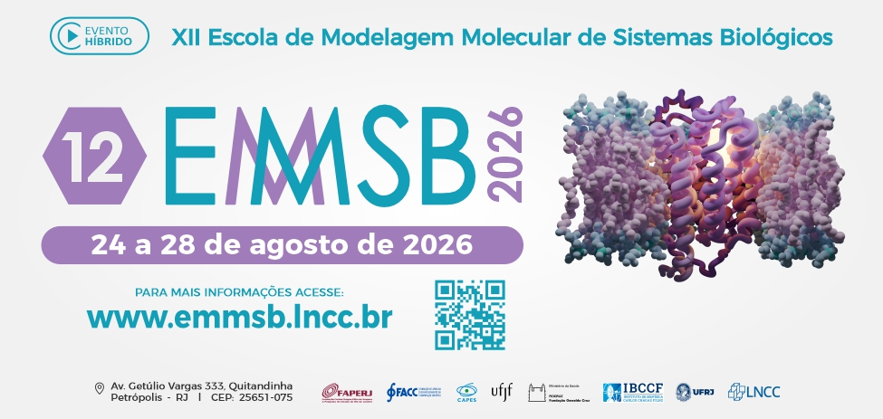

### XII Escola de Modelagem Molecular de Sistemas Biológicos - [LNCC/MCTI](https://www.gov.br/lncc/pt-br)

> Repositório para materiais e documentos relevantes usados na [XII EMMSB](https://www.emmsb.lncc.br/).

## Minicurso de Aprendizado de Máquina

Material do minicurso de aprendizado de máquina da XII EMMSB: [monteirotorres.github.io/ml/xiiemmsb](https://monteirotorres.github.io/ml/xiiemmsb).

